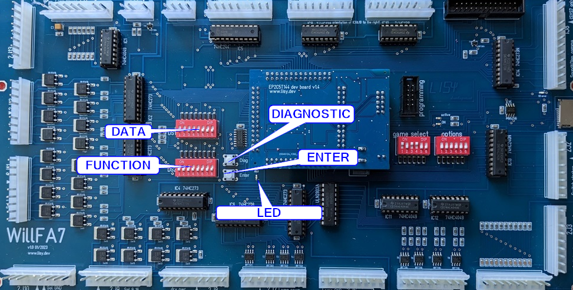

# WillFA7S

**Williams MPU with integrated sound board, based on FPGA**

**Hardware version v1.0**

**Software Version 6.22**

**user manual**

ralf@lisy.dev

v1.22 02.08.2026

## Table of contents

- [Important remark](#important-remark)
- [1. Introduction](#1-introduction)
- [2. Quickstart](#2-quickstart)
- [3. Installation](#3-installation)
- [4. Dip Switch Settings](#4-dip-switch-settings)
  - [4.1. DIP Switch S1: game select](#41-dip-switch-s1-game-select)
  - [4.2. DIP Switch S2: options](#42-dip-switch-s2-options)
  - [4.3. DIP Switch S5: sound board options](#43-dip-switch-s5-sound-board-options)
    - [4.3.1. S5-Dip1 -> chimes or synthesized sounds](#431-s5-dip1---chimes-or-synthesized-sounds)
    - [4.3.2. S5-Dip2 -> speech](#432-s5-dip2---speech)
    - [4.3.3. S5-Dip3 -> reserved](#433-s5-dip3---reserved)
    - [4.3.4. S5-Dip4 -> what the sound test button does](#434-s5-dip4---what-the-sound-test-button-does)
  - [4.4. All DIPs are read once, at boot](#44-all-dips-are-read-once-at-boot)
- [5. Boot sequence](#5-boot-sequence)
  - [5.1. Phase 1: boot message](#51-phase-1-boot-message)
  - [5.2. Phase 2: SD card read](#52-phase-2-sd-card-read)
  - [5.3. Phase 3: program execution](#53-phase-3-program-execution)
- [6. Game settings](#6-game-settings)
- [7. The integrated sound board](#7-the-integrated-sound-board)
  - [7.1. Which sound board it replaces](#71-which-sound-board-it-replaces)
  - [7.2. Where the sound commands come from](#72-where-the-sound-commands-come-from)
  - [7.3. Audio output](#73-audio-output)
  - [7.4. The sound test](#74-the-sound-test)
  - [7.5. Games with limited sound support](#75-games-with-limited-sound-support)
- [8. Software, SD card image and programming the FPGA](#8-software-sd-card-image-and-programming-the-fpga)
- [9. Structure of SD card](#9-structure-of-sd-card)
  - [9.1. Slot layout](#91-slot-layout)
  - [9.2. The CRC](#92-the-crc)
  - [9.3. Use your own roms](#93-use-your-own-roms)
- [Appendix A 'game select'](#appendix-a-game-select)

## Important remark

By using WillFA7S it is possible to damage your pinball machine. As this is a private project with NO commercial interest the author accepts no liability for any damage that may arise by using WillFA7S!

## 1. Introduction

WillFA7S is a WillFA7 with a Williams sound board built into the same FPGA. It emulates the hardware of a Williams MPU type SYS3 up to SYS7 with the driverboard integrated on the PCB **and**, on the same chip, a second complete computer: the Williams sound board type 1 / type 2 with its own 6802, its own PIA, its own program roms, the DAC and the CVSD speech decoder.

So one board replaces the MPU, the driver board and the sound board.

The FPGA is a Cyclone IV EP4CE10 - bigger than the one on the plain WillFA7 boards, because the five sound board roms need the extra memory. **All SYS3..SYS7 games are supported**, including 'Defender' and 'Star Light'.

**Everything that is not about the sound board works exactly as on a WillFA7** - the address space, the switch matrix and its debouncing, solenoids, lamps, displays, the settings eeprom, the boot phases. If something is not mentioned here, look it up in the WillFA7 manual; it applies unchanged.

**What do you need?**

- Possibility to read/write micro SD cards

- A PC with an USB port in order to be able to program the FPGA

**Two things are different from the very start, please read them before you begin:**

- **The SD card is not the same.** WillFA7S needs its own image with 64 KByte per game instead of 12, because the sound board roms travel on the card as well. A WillFA7 card does not boot here, and a WillFA7S card does not boot on a WillFA7. See chapter 9.

- **There is one more DIP bank**, S5 with four switches, for the sound board options. See chapter 4.3.

## 2. Quickstart

1.  Download the latest **WillFA7S** SD card image and the FPGA program from lisy.dev

2.  Write the image to a SD card

3.  Program the FPGA

4.  Configure switch 'game select' according to your pinball ( Appendix A )

5.  Set the sound board options on S5 ( chapter 4.3 ) - for most games all 'OFF' is right

6.  Replace your original Williams MPU, Driverboard and sound board with WillFA7S

7.  On first boot with your game set option DIP1 to ON ( init nvram)

    1.  Switch the game ON

    2.  Game will show Williams prom number, wait until 'Diag LED' goes off

    3.  Switch the game OFF

8.  Switch the Game ON

9.  Enjoy

## 3. Installation

WillFA7S has the same connectors and the same mounting holes as the original Williams MPUs, so replacing the board can be done in seconds. The board needs to be placed at the former location of the Williams driverboard.

The audio output of the integrated sound board goes to the amplifier of your machine. The original sound board is no longer needed and can stay out.

The connector for an external sound board still carries the sound commands, exactly as on a WillFA7. Both work at the same time: whatever the game sends to the internal sound board is also present on that connector.

## 4. Dip Switch Settings

### 4.1. DIP Switch S1: game select

Here you can select what game WillFA7S should run. This depends on the roms placed on the SD card. See Appendix A for a full list and chapter 9 for the structure of the SD card content.

### 4.2. DIP Switch S2: options

Identical to WillFA7, default all 'OFF':

| DIP    | Function                                                                     |
|--------|------------------------------------------------------------------------------|
| Dip1   | init nvram - set to ON for the very first boot with your game                 |
| Dip2/3 | pulse time of the special solenoids: OFF-OFF 60ms, OFF-ON 50ms, ON-OFF 40ms, ON-ON 35ms |
| Dip4   | special solenoid debounce: OFF = 57µs, ON = 250µs                            |
| Dip5   | switch matrix debounce: ON = debounced, OFF = passed through unfiltered       |
| Dip6   | no protection on spec. sol 6 (SOL 22), needed for the game 'CONTACT'          |

The WillFA7 manual describes these in detail.

### 4.3. DIP Switch S5: sound board options

This bank does not exist on a WillFA7. It sets up the sound board, the same way the DS1 switch does on an original Williams sound board. **Default setting is all 'OFF'** - that is the right setting for most games.

#### 4.3.1. S5-Dip1 -\> chimes or synthesized sounds

'ON' selects chime notes, 'OFF' selects synthesized sounds. This is the same switch as position 1 of DS1 on the original sound board. Which one your game wants is written in the manual of your pinball machine; the early System 3 games are the ones that use chimes.

#### 4.3.2. S5-Dip2 -\> speech

'ON' tells the sound board that speech is present, 'OFF' that it is not. Only type 2 sound boards - the ones with the speech roms - have speech at all, so leave this 'OFF' for a game without speech.

#### 4.3.3. S5-Dip3 -\> reserved

Not used, leave it 'OFF'.

Up to software 6.03 this switch selected where the sound commands come from, System 3/4 or System 6/7. Since 6.22 the board works that out from the game number by itself, so there is nothing left to set. See chapter 7.2.

#### 4.3.4. S5-Dip4 -\> what the sound test button does

The board has a sound test push button. This switch decides what pressing it does:

- **'OFF'** - the button acts as the test button of the sound board itself, exactly like the one on an original Williams sound board. The sound board plays its own test sound.

- **'ON'** - the button starts the built-in sound test of WillFA7S, with which you can step through all sound numbers and play them one by one. See chapter 7.4.

### 4.4. All DIPs are read once, at boot

**This is the one thing that catches people out.** On WillFA7S the DIP switches are read exactly once, during the boot phase, and then the lines they sit on are handed back to the switch matrix of the game. Reading them continuously would disturb the switch matrix while the game runs.

**So: after changing any DIP switch - game select, options or sound board options - switch the machine off and on again.** A change during the game has no effect.

## 5. Boot sequence

### 5.1. Phase 1: boot message

Immediately after switching on the pinball the 'ON' Led will go on and you will see the following output on the display of your pinball machine:

Player 1: version of the FPGA program running - it starts with a **6** on WillFA7S

Player 2: value of selected game on S1 (game select)

Player 3: **checksum of the game data, as computed while reading the card** (4 hex digits)

Player 4: **checksum of the game data, as stored on the card** (4 hex digits)

Credit Display: the option switches - **the left two digits are the sound board options S5, the right two the game options S2**

On a WillFA7 displays 3 and 4 show the lisy.dev identifier and the boot phase instead. WillFA7S uses them for the two checksums, because there is a lot more data to read here and it is worth knowing that it arrived intact.

**The two values on player 3 and player 4 must be identical.** If they are not, see chapter 9.2.

The option value is formed like this: each switch that is 'ON' adds its weight.

- sound board options S5: Dip1 = 1, Dip2 = 2, Dip3 = 4, Dip4 = 8, so 0…15
- game options S2: Dip1 = 1, Dip2 = 2, Dip3 = 4, Dip4 = 8, Dip5 = 16, Dip6 = 32, so 0…63

This is the same counting as the game select switch S1 in appendix A: Dip1 is always the
one that counts 1.

### 5.2. Phase 2: SD card read

WillFA7S reads 64 KByte from the card: the game roms, the sound board roms and the checksum. If this fails the red LED 'SD card error' will go ON and '56' will be shown on display 4.

The red LED also blinks a code that tells you what went wrong. Count the blinks; after the last one there is a pause of about 2 seconds, then the group repeats.

| Blinks | Meaning                                                              |
|--------|----------------------------------------------------------------------|
| 1      | the SPI transfer stalled - check the card contacts and the wiring      |
| 2      | the card does not answer the reset command                            |
| 3      | card type not supported, most likely a very old SD v1 card            |
| 4      | the card never finished its initialisation                            |
| 5      | no data arrived from the card                                         |
| 6      | the card reported a read error                                        |
| 7      | **checksum mismatch** - the game data on the card is not intact       |

Code 7 only exists on WillFA7S. See chapter 9.2.

### 5.3. Phase 3: program execution

The code indicated by the Dip switch 'game select' is read from the SD card and executed. If the code runs ( regular display strobes are present) the 'active' LED will go ON. The sound board starts together with the game.

## 6. Game settings

Game settings are made exactly as on a WillFA7 and as on the original MPU; WillFA7S uses a serial EEPROM to store them individually per game.

- **System 3 and System 4**: with the Data, Enter, Diagnostic and Function switches on the board.
- **System 6 and System 7**: through the coin door, with the Advance button and the Auto/Manual switch, following the manual of your pinball game.

The step by step procedure for System 3 and the picture with the button locations are in chapter 6 of the WillFA7 manual - they are the same board positions here.



**One difference while the sound test runs:** the Diag button steps through the sound numbers instead of triggering the diagnostic interrupt, and Enter plays the selected sound instead of storing a setting. That lasts only as long as the sound test is active, see chapter 7.4.

## 7. The integrated sound board

### 7.1. Which sound board it replaces

The Williams sound boards of System 3 to System 7, type 1 (sound only) and type 2 (sound and speech). Inside the FPGA this is a full rebuild: a second 6802 processor, its own PIA, 128 byte of ram, five 4 KByte program roms, the DAC for the sound and a HC55564 CVSD decoder for the speech.

The five rom blocks are filled from the SD card at boot, together with the game roms - which is why the card layout is different, see chapter 9.

### 7.2. Where the sound commands come from

Williams did this differently over the years:

- **System 6 and System 7** send the sound commands from the MPU over five dedicated lines.
- **System 3 and System 4** use the solenoid outputs 9 to 13 for it.

WillFA7S picks the right source **automatically, from the game number** you set on S1. There is nothing to configure. Up to software 6.03 this was a DIP switch; since 6.22 it follows the game number, the same source of truth the memory protection uses.

### 7.3. Audio output

Sound and speech are mixed inside the FPGA and leave the board together on one line, in a fixed 1:1 ratio. That is what the original does too, only there it happens in the analog domain: the sound signal goes over to the speech module, is mixed with the speech through the 5K pot R8 and comes back. R8 in its middle position is the 1:1 mix that is built here.

A game can therefore play a sound effect and speech at the same time, as on the original.

### 7.4. The sound test

Set **S5-Dip4 to 'ON'** and restart. Then press the sound test button on the board:

- the display shows the current sound number - the tens digit on player display 1, the units digit on player display 2
- **Diag** steps to the next sound number, 1 to 31 and then back to 1
- **Enter** plays the sound number that is shown

While the sound test is active it takes over the display, and the diagnostic interrupt of the MPU is blocked so that the Diag button does not do two things at once.

With **S5-Dip4 to 'OFF'** the same button acts as the test button of the sound board itself, exactly like on an original Williams sound board.

### 7.5. Games with limited sound support

Five games in the list use a sound command layout that WillFA7S does not reproduce completely:

**World Cup (2), Contact (3), Disco Fever (4), Phoenix (6)** and **Warlok (25)**.

**Warlok** needs a sixth sound select line, which the original brings over with the jumper W12 on the sound board. WillFA7S rebuilds the Williams sound and comma latch as it is, and that latch carries five lines - so there is no sixth line to pass on.

**World Cup, Contact, Disco Fever and Phoenix** are the early System 3 games. They arrange their sound commands differently: one of the five bits sits on another input of the sound board, and two inputs are held high. That layout is not rebuilt either.

In both cases the games run and play, but some of their sounds will not be the right ones.

Everything else in the list is unaffected.

## 8. Software, SD card image and programming the FPGA

Everything you need to get the software onto the board is described on my website, and it is kept up to date there:

> **<https://lisy.dev/documentation-01.html>**

You will find there:

- the latest FPGA program and the latest SD card image for download

- how to write the image to a SD card

- which programmer software you need, how to install the driver for the USB Blaster and how to program the FPGA

**Make sure you take the WillFA7S versions of both** - the FPGA program shows a version starting with 6, and the SD card image is the one with 64 KByte per game.

## 9. Structure of SD card

Due to limitations of the SD card read routine in the FPGA (it does read fix sector numbers instead of looking for filenames) it is necessary to use my SD-card image. You can write the image to a SD-card of your choice.

The first slot starts at sector 660, as on WillFA7. **The slot size is the difference:** 128 sectors of 512 bytes, that is 64 KByte per game, instead of 24 sectors / 12 KByte. The slot of a game starts at sector 660 + game number x 128.

### 9.1. Slot layout

```
0x0000 - 0x2FFF   12 KByte   game roms, 6 x 2K   -> the MPU sees them from $5000 on
0x3000 - 0x7FFF   20 KByte   sound board roms, 5 x 4K
0x8000 - 0xFFFD              free
0xFFFE - 0xFFFF    2 Byte    checksum (CRC16-CCITT) over the first 32 KByte
```

The first 12 KByte are bit for bit the same as in a WillFA7 image - only the slot around them is bigger.

### 9.2. The CRC

WillFA7S computes a checksum over the game data while it reads the card and compares it with the value stored in the last two bytes of the slot.

- during boot the computed value is on player display 3 and the stored value on player display 4, **they must be identical**
- if they differ, the red 'SD card error' LED blinks the code **7**, the error display shows a leading **7**, and **the game does not start**

That last part is on purpose. Running a game from rom data that is known to be damaged would be worse than showing an error.

If you get code 7: rewrite the card image, and if it happens again try a different card.

### 9.3. Use your own roms

The SD card image holds one slot per game number, so a rom set can be exchanged without changing the FPGA program.

Write your rom set to the position given above with a sector editor. It is read as one block and has to be complete: 12 KByte of game roms, then the 20 KByte of sound board roms.

**And you have to fix up the checksum.** After changing anything in the first 32 KByte of a slot, the CRC16-CCITT over those 32 KByte has to be recomputed and written to 0xFFFE / 0xFFFF of the slot, otherwise the board will refuse to start the game with error code 7.

## Appendix A 'game select'

| **No** | **S1** | **S2** | **S3** | **S4** | **S5** | **S6** | **type** | **Name**        |
|-------:|--------|--------|--------|--------|--------|--------|----------|-----------------|
|      0 | off    | off    | off    | off    | off    | off    | SYS3     | Hot Tip         |
|      1 | on     | off    | off    | off    | off    | off    | SYS3     | Lucky Seven     |
|      2 | off    | on     | off    | off    | off    | off    | SYS3     | World Cup \*    |
|      3 | on     | on     | off    | off    | off    | off    | SYS3     | Contact \*      |
|      4 | off    | off    | on     | off    | off    | off    | SYS3     | Disco Fever \*  |
|      5 | on     | off    | on     | off    | off    | off    | SYS4     | Pokerino        |
|      6 | off    | on     | on     | off    | off    | off    | SYS4     | Phoenix \*      |
|      7 | on     | on     | on     | off    | off    | off    | SYS4     | Flash           |
|      8 | off    | off    | off    | on     | off    | off    | SYS4     | Stellar Wars    |
|      9 | on     | off    | off    | on     | off    | off    | SYS6     | Tri Zone        |
|     10 | off    | on     | off    | on     | off    | off    | SYS6     | Time Warp       |
|     11 | on     | on     | off    | on     | off    | off    | SYS6     | Gorgar          |
|     12 | off    | off    | on     | on     | off    | off    | SYS6     | Laser Ball      |
|     13 | on     | off    | on     | on     | off    | off    | SYS6     | Firepower       |
|     14 | off    | on     | on     | on     | off    | off    | SYS6     | Blackout        |
|     15 | on     | on     | on     | on     | off    | off    | SYS6     | Scorpion        |
|     16 | off    | off    | off    | off    | on     | off    | SYS6A    | Algar           |
|     17 | on     | off    | off    | off    | on     | off    | SYS6A    | Alien Poker     |
|     18 | off    | on     | off    | off    | on     | off    | SYS7     | Black Knight    |
|     19 | on     | on     | off    | off    | on     | off    | SYS7     | Jungle Lord     |
|     20 | off    | off    | on     | off    | on     | off    | SYS7     | Pharaoh         |
|     21 | on     | off    | on     | off    | on     | off    | SYS7     | Solar Fire      |
|     22 | off    | on     | on     | off    | on     | off    | SYS7     | Barracora       |
|     23 | on     | on     | on     | off    | on     | off    | SYS7     | Cosmic Gunfight |
|     24 | off    | off    | off    | on     | on     | off    | SYS7     | Varkon          |
|     25 | on     | off    | off    | on     | on     | off    | SYS7     | Warlok \*       |
|     26 | off    | on     | off    | on     | on     | off    | SYS7     | Time Fantasy    |
|     27 | on     | on     | off    | on     | on     | off    | SYS7     | Joust           |
|     28 | off    | off    | on     | on     | on     | off    | SYS7     | Firepower II    |
|     29 | on     | off    | on     | on     | on     | off    | SYS7     | Laser Cue       |
|     30 | off    | on     | on     | on     | on     | off    | SYS7     | Defender        |
|     31 | on     | on     | on     | on     | on     | off    | SYS7     | Star Light      |

(\*) sound support is incomplete for these games, see chapter 7.5
