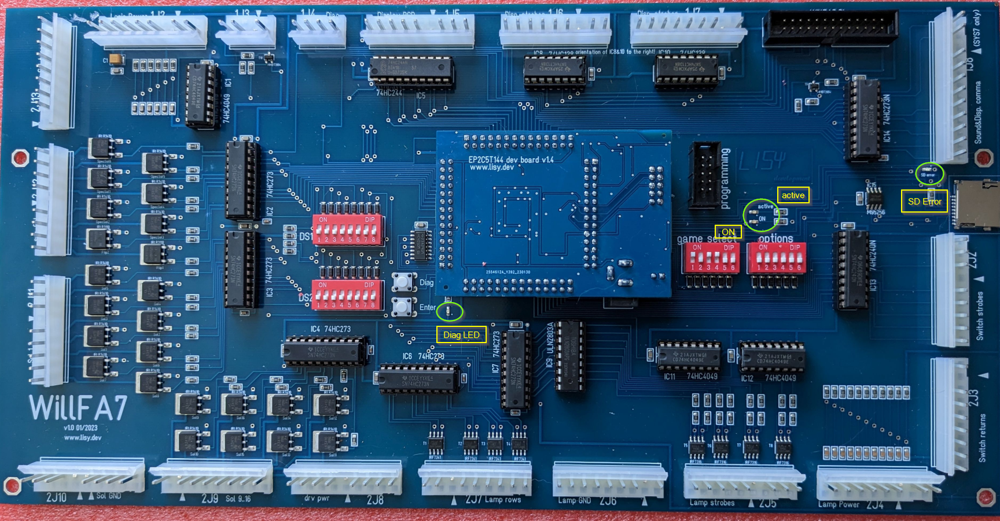

# WillFA7

**Williams MPU based on FPGA**

**Hardware version v1.3**

**Software Version x.22**

**user manual**

ralf@lisy.dev

v1.22 04.08.2026

## Table of contents

- [Important remark](#important-remark)
- [1. Introduction](#1-introduction)
- [2. Quickstart](#2-quickstart)
- [3. Installation](#3-installation)
- [4. Dip Switch Settings](#4-dip-switch-settings)
  - [4.1. DIP Switch S1: game select](#41-dip-switch-s1-game-select)
  - [4.2. DIP Switch S2: options](#42-dip-switch-s2-options)
    - [4.2.1. S2-Dip1 -> init nvram](#421-s2-dip1---init-nvram)
    - [4.2.2. S2-Dip2 & DIP3 pulse time](#422-s2-dip2--dip3-pulse-time)
    - [4.2.3. S2-Dip4 -> special solenoid debounce](#423-s2-dip4---special-solenoid-debounce)
    - [4.2.4. S2-Dip5 -> switch matrix debounce](#424-s2-dip5---switch-matrix-debounce)
    - [4.2.5. S2-Dip6 no protection on spec. sol 6 (SOL 22)](#425-s2-dip6-no-protection-on-spec-sol-6-sol-22)
- [5. Boot sequence](#5-boot-sequence)
  - [5.1. Phase 1: boot message](#51-phase-1-boot-message)
  - [5.2. Phase 2: SD card read](#52-phase-2-sd-card-read)
  - [5.3. Phase 3: program execution](#53-phase-3-program-execution)
- [6. Game settings](#6-game-settings)
  - [6.1. System3](#61-system3)
  - [6.2. System4](#62-system4)
  - [6.3. System6](#63-system6)
  - [6.4. System7](#64-system7)
- [7. Software, SD card image and programming the FPGA](#7-software-sd-card-image-and-programming-the-fpga)
- [8. Structure of SD card](#8-structure-of-sd-card)
  - [8.1. WillFA7 image](#81-willfa7-image)
  - [8.2. Use your own roms](#82-use-your-own-roms)
- [Appendix A 'game select'](#appendix-a-game-select)

## Important remark

By using WillFA7 it is possible to damage your pinball machine. As this is a private project with NO commercial interest the author accepts no liability for any damage that may arise by using WillFA7!

## 1. Introduction

WillFA7 uses a (low cost) FPGA which emulates the hardware of a Williams MPU type SYS3 up to SYS7; the driverboard is integrated on the PCB.

**Note:** The games 'Defender' and 'Star Light' are not supported on the 'standard' Cyclone II board. To run them you need my Cyclone IV board. With the Cyclone IV board **all SYS3..SYS7 games** are supported.

**Note:** If you also want to replace the sound board, have a look at **WillFA7S**. It is the same MPU with a Williams sound board built into the same FPGA, and it has its own manual.

**What do you need?**

- Possibility to read/write micro SD cards

- A PC with an USB port in order to be able to program the FPGA

## 2. Quickstart

1.  Download latest versions of the SD card Image and the FPGA program from lisy.dev

2.  Write the image to a SD card

3.  Program the FPGA

4.  Configure switch 'game select' according to your pinball ( Appendix A )

5.  Replace your original Williams MPU and Driverboard with WillFA7

6.  On first boot with your game set option DIP1 to ON ( init nvram)

    1.  Switch the game ON

    2.  Game will show Williams prom number, wait until 'Diag LED' goes off

    3.  Switch the game OFF

7.  Switch the Game ON

8.  Enjoy

## 3. Installation

WillFA7 boards have the same connectors and same mounting holes as the original Williams MPUs, so replacing of the board can be done in seconds. The board needs to be placed at the former location of the Williams driverboard.

## 4. Dip Switch Settings

### 4.1. DIP Switch S1: game select

Here you can select what game WillFA7 should run. This depends on the roms placed on the SD card. See Appendix A for a full list and Chapter 'SD card' for an explanation of the structure of the SD card content.

### 4.2. DIP Switch S2: options

Default setting is all 'OFF'

#### 4.2.1. S2-Dip1 -\> init nvram

With Dip1 to 'ON' WillFA7 during boot will initialize the nvram ram for the selected game to zero. This is useful if you want to reset ALL ram content **and for the very first boot with your game.**

#### 4.2.2. S2-Dip2 & DIP3 pulse time

With DIP2 & DIP3 the pulse time for the special solenoids can be adjusted. By default (both OFF) the pulse time is 60ms which should fit the original gameplay. Possible settings are:

OFF – OFF 60ms

OFF – ON 50ms

ON – OFF 40ms

ON – ON 35ms

#### 4.2.3. S2-Dip4 -\> special solenoid debounce

The trigger inputs of the special solenoids are debounced inside the FPGA. With DIP4 to 'OFF' the filter is 57µs, with DIP4 to 'ON' it is 250µs. Default is 'OFF'.

#### 4.2.4. S2-Dip5 -\> switch matrix debounce

With DIP5 to 'ON' the returns of the switch matrix are debounced inside the FPGA. With DIP5 to 'OFF' they are passed through unfiltered, which is the behaviour of software x.17 and earlier. Default is 'OFF'.

#### 4.2.5. S2-Dip6 no protection on spec. sol 6 (SOL 22)

Needed for game 'CONTACT' as spec. sol 6 needs to be permanently activated (moving target relay) pin 9 on 2P12

## 5. Boot sequence

### 5.1. Phase 1: boot message

Immediately after switching on the pinball the 'ON' Led will go on and you will see the following output on the display of your pinball machine

Player 1: version of the FPGA program running

Player 2: value of selected game on S1 (game select)

Player 3: checksum of the game data computed while reading the card (four hex digits)

Player 4: checksum stored on the card (four hex digits) - **the two have to be identical**

Credit Display: value of the option switches S2 (game options)

Until version .21 player 3 showed a fixed build date and player 4 the boot phase. Both moved
aside for the two checksums with .22; the boot phase is still shown on player 4 whenever the
'SD card error' LED is on, together with the error digit.

**Seven digit displays.** Games marked `SYS6A` or `SYS7` in appendix A came with seven
digit player displays instead of six. WillFA7 knows this from the game number and moves the
boot message accordingly: the text stands right aligned, the leftmost digit of each player
display stays dark, and the options keep their place on the credit display. Nothing has to
be set for this.

### 5.2. Phase 2: SD card read

WillFA7 tries to read the SD card content. If this fails the red LED 'SD card error' will go ON and '56' will be shown on display 4.

The red LED also blinks a code that tells you what went wrong. Count the blinks; after the last one there is a pause of about 2 seconds, then the group repeats.

| Blinks | Meaning                                                              |
|--------|----------------------------------------------------------------------|
| 1      | the SPI transfer stalled - check the card contacts and the wiring      |
| 2      | the card does not answer the reset command                            |
| 3      | card type not supported, most likely a very old SD v1 card            |
| 4      | the card never finished its initialisation                            |
| 5      | no data arrived from the card                                         |
| 6      | the card reported a read error                                        |
| 7      | the game data on the card does not match its checksum - see chapter 8 |

Code 7 is what you get if you put a card made for version .21 or older into a .22 board. The
card layout changed with .22, see chapter 8.

### 5.3. Phase 3: program execution

The code indicated by the Dip switch 'game select' is read from the SD card and executed. If the code runs ( regular display strobes are present) the 'active' LED will go ON.

## 6. Game settings

In general game settings can be done in the same way as with the original MPU. WillFA7 uses a serial EEPROM to store the game settings individually per game. There are small differences due to the different board layout which are described below.

### 6.1. System3

WillFA7 has only one diagnostic LED, but does provide Data, Enter, Diagnostic and Function switches with the same functionality as with the original board. Refer to the picture below for the locations on the WillFA7 board. For settings have a look at the manual of your Williams pinball game.

Setting on SYS3 with WillFA7:

Do a 'fresh' boot ( Turning OFF the machine and then turning it back ON )

Press the 'Diag' button on WillFA7, the LED nearby will blink twice

Determine which function is to be changed by looking at table 1 in your game Manual.

Set the Bottom switch to the function you want to change

( e.g. function 19 'Maximum Tilts' by setting Dip 4,7 & 8 to ON )

Set the Top switch to the value you want to store

( e.g. to 1 by setting DIP 8 to ON ( default is 3 ))

To store the value press 'Enter', the LED nearby will blink to indicate the change has been made.

You can check the values by pressing 'Advance' in the coin door

The status display will show '1804' to indicate that you are in 'test 4' and can read

the value for 'Readout No.' 18 ( High Score to date) in display for player 1

By pressing Advance again you step through the different Readouts.

After Readout 23 it starts again with Readout 1 (Replay 1). Have a look at your game Manual for a complete list!

### 6.2. System4

Settings for SYS4 games are made in the same way as with the original MPU, using the Data, Enter, Diagnostic and Function switches on the board. Refer to the picture in chapter 'system3' for their location.

### 6.3. System6

From SYS6 on, the settings are made through the coin door, with the Advance button and the Auto/Manual switch, exactly as described in the manual of your pinball game. WillFA7 passes both signals to the emulated MPU in the same way as the original board, so the procedure is unchanged.

### 6.4. System7

SYS7 games are set up through the coin door in the same way as SYS6, see above, following the manual of your pinball game.

## 7. Software, SD card image and programming the FPGA

Everything you need to get the software onto the board is described on my website, and it is kept up to date there:

> **<https://lisy.dev/documentation-01.html>**

You will find there:

- the latest FPGA program and the latest SD card image for download

- how to write the image to a SD card

- which programmer software you need, how to install the driver for the USB Blaster and how to program the FPGA

This used to be two chapters of this manual. It was moved to the website because the download links, the tool versions and the Intel download pages change far more often than this manual does.

## 8. Structure of SD card

Due to limitations of the SD card read routine in the FPGA (it does read fix sector numbers instead of looking for filenames) it is necessary to use my SD-card image ( 128 Mbyte). You can write the image to a SD-card of your choice.

With game select all '0' WillFA7 will try to read the first rom image at sector number 660. With my 128MB WillFA7 image this is the location of the first file you write to an empty SD card.

### 8.1. WillFA7 image

**My WillFA7 SD card image has almost all available roms 'on board'. See appendix A for a gamelist**

**Important for anyone updating from .21 or older:** the card layout changed with version .22.
There used to be three of them - 10 KByte per game for Cyclone II, 12 KByte for Cyclone IV and
Cyclone 10, 64 KByte for WillFA7S. Now there is one, the WillFA7S one, and it works on every
board. **Your old card will not run on a .22 board**; it reports error code 7 (see chapter 5.2)
instead of starting a game, which is deliberate - a wrong game image is worse than a clear error.
Write the current image to your card and you are done.

### 8.2. Use your own roms

The SD card image holds one slot per game number, so a rom set can be exchanged without changing the FPGA program.

Every slot is 128 sectors of 512 bytes, that is 64 KByte, and the first slot starts at sector 660. The slot of a game therefore starts at sector 660 + game number x 128, with the game number being the value set on switch S1 (see Appendix A).

A slot is filled like this:

| Offset in the slot | Size | Content |
|---|---|---|
| 0x0000 - 0x2FFF | 12 KByte | game roms, 6 x 2K, seen by the MPU from \$5000 on |
| 0x3000 - 0x7FFF | 20 KByte | sound board roms - only WillFA7S uses them, but they belong on every card |
| 0x8000 - 0xFFFD | | unused |
| 0xFFFE - 0xFFFF | 2 bytes | checksum, CRC16-CCITT over the first 32 KByte of the slot |

Write your rom set to that position with a sector editor. It is read as one block and has to be complete. Boards with Cyclone IV or Cyclone 10 use all 12 KByte of game rom; boards with Cyclone II have one rom block less and ignore the first 2 KByte, so the games that need the full 12 KByte (Defender, Star Light) do not run there.

**And you have to fix up the checksum.** After changing anything in the first 32 KByte of a slot, recompute the CRC16-CCITT over those 32 KByte and write it to 0xFFFE / 0xFFFF of the slot - otherwise the board refuses to start the game with error code 7. While reading, the board shows the computed checksum on display 3 and the one it read from the card on display 4; if they differ, you can see it right there.

## Appendix A 'game select'

| **No** | **S1** | **S2** | **S3** | **S4** | **S5** | **S6** | **type** | **Name**        |
|-------:|--------|--------|--------|--------|--------|--------|----------|-----------------|
|      0 | off    | off    | off    | off    | off    | off    | SYS3     | Hot Tip         |
|      1 | on     | off    | off    | off    | off    | off    | SYS3     | Lucky Seven     |
|      2 | off    | on     | off    | off    | off    | off    | SYS3     | World Cup       |
|      3 | on     | on     | off    | off    | off    | off    | SYS3     | Contact         |
|      4 | off    | off    | on     | off    | off    | off    | SYS3     | Disco Fever     |
|      5 | on     | off    | on     | off    | off    | off    | SYS4     | Pokerino        |
|      6 | off    | on     | on     | off    | off    | off    | SYS4     | Phoenix         |
|      7 | on     | on     | on     | off    | off    | off    | SYS4     | Flash           |
|      8 | off    | off    | off    | on     | off    | off    | SYS4     | Stellar Wars    |
|      9 | on     | off    | off    | on     | off    | off    | SYS6     | Tri Zone        |
|     10 | off    | on     | off    | on     | off    | off    | SYS6     | Time Warp       |
|     11 | on     | on     | off    | on     | off    | off    | SYS6     | Gorgar          |
|     12 | off    | off    | on     | on     | off    | off    | SYS6     | Laser Ball      |
|     13 | on     | off    | on     | on     | off    | off    | SYS6     | Firepower       |
|     14 | off    | on     | on     | on     | off    | off    | SYS6     | Blackout        |
|     15 | on     | on     | on     | on     | off    | off    | SYS6     | Scorpion        |
|     16 | off    | off    | off    | off    | on     | off    | SYS6A    | Algar           |
|     17 | on     | off    | off    | off    | on     | off    | SYS6A    | Alien Poker     |
|     18 | off    | on     | off    | off    | on     | off    | SYS7     | Black Knight    |
|     19 | on     | on     | off    | off    | on     | off    | SYS7     | Jungle Lord     |
|     20 | off    | off    | on     | off    | on     | off    | SYS7     | Pharaoh         |
|     21 | on     | off    | on     | off    | on     | off    | SYS7     | Solar Fire      |
|     22 | off    | on     | on     | off    | on     | off    | SYS7     | Barracora       |
|     23 | on     | on     | on     | off    | on     | off    | SYS7     | Cosmic Gunfight |
|     24 | off    | off    | off    | on     | on     | off    | SYS7     | Varkon          |
|     25 | on     | off    | off    | on     | on     | off    | SYS7     | Warlok          |
|     26 | off    | on     | off    | on     | on     | off    | SYS7     | Time Fantasy    |
|     27 | on     | on     | off    | on     | on     | off    | SYS7     | Joust           |
|     28 | off    | off    | on     | on     | on     | off    | SYS7     | Firepower II    |
|     29 | on     | off    | on     | on     | on     | off    | SYS7     | Laser Cue       |
|     30 | off    | on     | on     | on     | on     | off    | SYS7     | Defender \*     |
|     31 | on     | on     | on     | on     | on     | off    | SYS7     | Star Light \*   |

(\*) Cyclone IV board & SD image needed

The **type** column also says which player displays the game came with: `SYS3`, `SYS4` and
`SYS6` are six digit, `SYS6A` (Algar and Alien Poker) and `SYS7` are seven digit. WillFA7
places its boot message according to that, see chapter 5.1.
